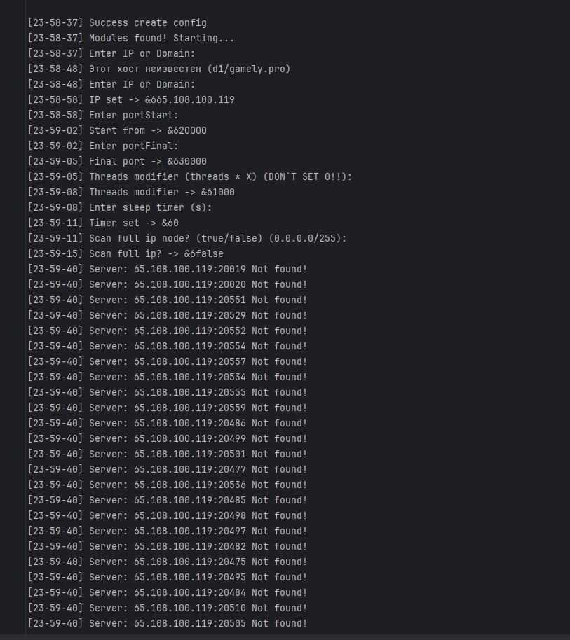

# PepeS
 **Java scanner for IP, Node and more with plugins!**
 **By: Delta~Cion**
 **For: Project~Violette**
 **Discord support server: *https://discord.gg/MEBkvJbe4P***

## Описание

Сканнер предназначен в первую очерень для установки на VDS|Java-Хост. 

Основное приемущество данного проекта в том, что вы можете без особого труда поставить его на любой бесплатный Minecraft хостинг, чтобы в дальнейшем запускать как сам сканнер, так и его модули (Среди которых есть прокси сервер, работающий на порту самого хоста. Пример - Порт 25565). Данная функция будет работать почти без доп настройки. 
Вам потребуется только указать имя и пароль для прокси, либо настроить бд для более широкого/публичного применения)

## Скриншоты
### Пример интерфейса
 
### Отправка онлайн серверов прямо в дискорд
 
### Отправка оффлайн серверов прямо в дискорд
 
### Логгирование всего вывода в sys-logs

 
## TODO
    - api Для написания модулей
    - Модуль проверки листов серверов (Валидность, ядра, кол-во игроков), 
       сохранение проверенных серверов в отдельный txt
    - Оптимизация кода (Ускорение, удаление лишних частей)
    - Замена MineStat в проекте на свой api (api в разработке)
    - Добавление очередей сканнирования
    - Разработка простого GUI консольного типа 
       окно ввода/вывода, 3 кнопки - Старт, Пауза, Остановка,
       Установка портов, Адреса/Домена.
       Включение/Выключение GUI будет происходить в (config|server).properties